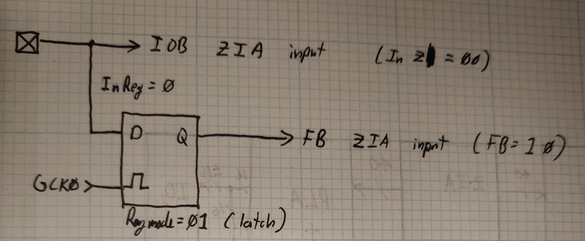
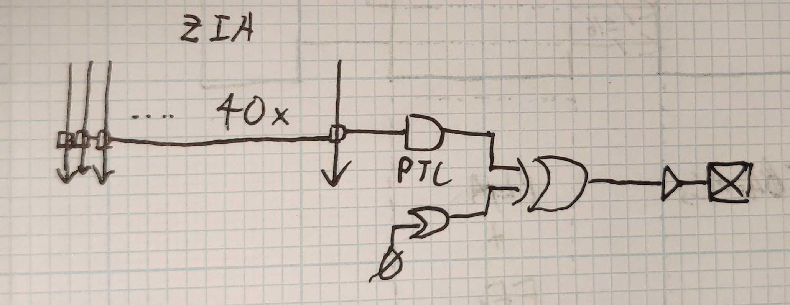

# xc2-zia-probe-thingy

Tool to extract CoolRunner-II ZIA table using JTAG

- [x] XC2C32(A) ([link](https://github.com/rqou/xc2-zia-probe-thingy/tree/xc2c32a))
- [x] XC2C64(A) ([link](https://github.com/rqou/xc2-zia-probe-thingy/tree/xc2c64a))
- [ ] XC2C128 (need new algorithm, need new JTAG code)
- [ ] XC2C256 (need new algorithm, need new JTAG code)
- [ ] XC2C384 (need hardware, need new algorithm, need new JTAG code)
- [ ] XC2C512 (need hardware, need new algorithm, need new JTAG code)

## Background

### CoolRunner-II Bitstream Documentation

[Andrew Zonenberg](https://twitter.com/azonenberg) and I have been documenting
the CoolRunner-II bitstream format in order to write open-source compilers
targeting this chip. This process has involved various methods including
guessing, putting chips under microscopes, and feeding test designs into the
vendor compiler toolchain.
([1](http://siliconexposed.blogspot.com/2014/03/getting-my-feet-wet-with-invasive.html)
[2](http://siliconexposed.blogspot.com/2014/03/getting-my-feet-wet-with-invasive_31.html)
[3](https://twitter.com/azonenberg/status/1212228778581053440))

### ZIA

One critical piece of information that needs to be recovered is the data
about how the ZIA is connected.

TODO: Explain how the ZIA works in a lot more detail?

The ZIA connectivity table has been successfully recovered for the XC2C32A
by putting a sample chip inside an electron microscope, but this method
tends to have long bottlenecks and does not scale well. This information must
exist somewhere inside the vendor toolchain, but we do not want to incur the
legal risk of reverse engineering the vendor toolchain under the jurisdiction
of the United States. Attempting to obtain this information by compiling
test designs has also been unsuccessful (because we do not appear to have
sufficient low-level control via the vendor toolchain to select ZIA
configurations of interest).

Is there another way we can obtain this information, preferably with minimal
involvement of the vendor toolchain? It turns out that this is indeed possible
by making use of JTAG boundary scan commands.

### JTAG and Boundary Scan

TODO: Explain how JTAG works?

One of the features that JTAG was designed to support is "boundary scan."
Boundary scan allows circuit boards (or other interconnects) to be tested by
measuring and overriding the state of pins.

Notably, CoolRunner-II parts support the `INTEST` command in addition to
`EXTEST`. This command allows an external tester (i.e. this script) to
override and measure all of the signals to/from the _internal logic_ of the
CPLD rather than the external pins. (If `INTEST` were not supported, it would
still have been possible to do something equivalent, but the process would
involve connecting external hardware. With `INTEST` support, no external
connections are required.).

## Summary of algorithm

TODO: XC2 architecture/macrocell overview?

We start by configuring every macrocell in the part except for one (the
designated output macrocell) like this:

In other words, the macrocell is configured so that the "pin" ZIA input path
is configured to come from the input pad and the "macrocell feedback" ZIA
input path is configured to come from the flip-flop configured as a transparent
latch. _Notably_, this configuration allows for the PLA to be ignored.

We configure the designated output macrocell like this:

In other words, the designated output macrocell is configured to directly
connect a ZIA row to an output pin. Both the "pin" and "macrocell feedback"
ZIA inputs are not enabled, so they will have constant values (verified by
previous hardware testing).

The algorithm then proceeds as follows:

> For each ZIA row in [0, 40)
>> For each one of the choices of output for this row
>>> 1. Generate a bitstream configuring the selected ZIA row to have the selected
    choice, and configure the designated output macrocell to output from the
    selected ZIA row
>>> 2. Flash the generated bitstream
>>> 3. For every single input pin:
>>>> 1. Set the input=0, GCK=0, measure output pin
>>>> 2. Set the input=1, GCK=0, measure output pin
>>>> 3. Set the input=0, GCK=1, measure output pin
>>>> 4. Set the input=1, GCK=1, measure output pin
>>>> 5. If changing the input from 0->1 while GCK=0 caused
        the output pin to change from 0->1, then we know that this
        particular choice in this particular ZIA row corresponds to this
        input pin. This is because no "macrocell feedback" value can
        change while GCK=0.
>>>> 6. Otherwise, if changing the input from 0->1 while GCK=1 caused
        the output pin to change from 0->1, then we know that this
        particular choice in this particular ZIA row corresponds to the
        macrocell feedback path for the macrocell attached to this input pin.
        This is because it cannot be any "pin" input (because those would have
        been found in step 5), and all latches now behave transparently because
        GCK=1.

NOTE: What happens if the input pin being tested is either the clock pin or the
designated output pin? The script special-cases these two possibilities and
uses an alternate bitstream that uses GCK1 instead of GCK0 and a different
designated output pin.
